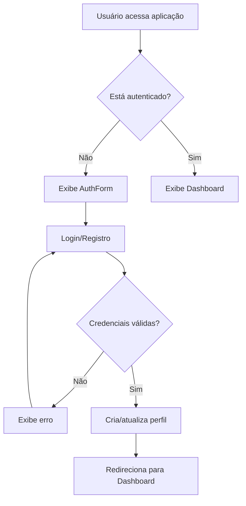
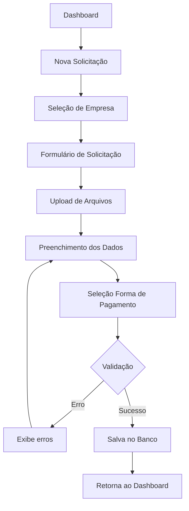

# Documentação do Sistema de Solicitação de Pagamento

## Índice
1. [Visão Geral do Projeto](#visão-geral-do-projeto)
2. [Arquitetura e Tecnologias](#arquitetura-e-tecnologias)
3. [Estrutura do Banco de Dados](#estrutura-do-banco-de-dados)
4. [Componentes e Funcionalidades](#componentes-e-funcionalidades)
5. [Fluxo de Autenticação](#fluxo-de-autenticação)
6. [Estrutura de Arquivos](#estrutura-de-arquivos)
7. [Configuração e Deploy](#configuração-e-deploy)

---

## Visão Geral do Projeto

O **Sistema de Solicitação de Pagamento** é uma aplicação web desenvolvida para gerenciar solicitações de pagamento de notas fiscais. O sistema permite que usuários autenticados criem, acompanhem e gerenciem solicitações de pagamento para diferentes empresas do grupo.

### Principais Funcionalidades

- **Autenticação de usuários** com email e senha
- **Seleção de empresa** para cada solicitação
- **Formulário completo** de solicitação de pagamento
- **Upload de arquivos** (nota fiscal e boleto)
- **Múltiplas formas de pagamento** (boleto, depósito bancário, PIX)
- **Acompanhamento de status** das solicitações
- **Interface responsiva** e intuitiva

---

## Arquitetura e Tecnologias

### Stack Tecnológico

- **Frontend**: React 18.3.1 com TypeScript
- **Build Tool**: Vite
- **Styling**: Tailwind CSS com shadcn/ui
- **Backend**: Supabase (PostgreSQL)
- **Autenticação**: Supabase Auth
- **Storage**: Supabase Storage
- **Formulários**: React Hook Form com Zod
- **Roteamento**: React Router DOM
- **UI Components**: Radix UI primitives

### Arquitetura

```
┌─────────────────┐    ┌─────────────────┐    ┌─────────────────┐
│   React Client  │◄──►│   Supabase API  │◄──►│   PostgreSQL    │
│                 │    │                 │    │   Database      │
│  - Components   │    │  - Auth         │    │                 │
│  - Hooks        │    │  - Database     │    │  - Tables       │
│  - Forms        │    │  - Storage      │    │  - RLS Policies │
│  - Routing      │    │  - Functions    │    │  - Triggers     │
└─────────────────┘    └─────────────────┘    └─────────────────┘
```

---

## Estrutura do Banco de Dados

### Tabelas Principais

#### 1. **profiles**
Armazena informações adicionais dos usuários registrados.

| Campo      | Tipo                     | Descrição                    |
|------------|--------------------------|------------------------------|
| id         | uuid (PK)               | Identificador único          |
| user_id    | uuid (FK)               | Referência ao usuário auth   |
| name       | text                    | Nome completo do usuário     |
| email      | text                    | Email do usuário             |
| created_at | timestamp with time zone| Data de criação              |
| updated_at | timestamp with time zone| Data da última atualização   |

**RLS Policies:**
- Usuários podem visualizar, inserir e atualizar apenas seus próprios perfis

#### 2. **empresas**
Cadastro das empresas do grupo.

| Campo      | Tipo                     | Descrição                    |
|------------|--------------------------|------------------------------|
| id         | uuid (PK)               | Identificador único          |
| nome       | text                    | Nome da empresa              |
| codigo     | text                    | Código da empresa            |
| created_at | timestamp with time zone| Data de criação              |

**RLS Policies:**
- Usuários autenticados podem visualizar todas as empresas

#### 3. **setores**
Cadastro dos setores/departamentos.

| Campo      | Tipo                     | Descrição                    |
|------------|--------------------------|------------------------------|
| id         | uuid (PK)               | Identificador único          |
| nome       | text                    | Nome do setor                |
| created_at | timestamp with time zone| Data de criação              |

**RLS Policies:**
- Usuários autenticados podem visualizar todos os setores

#### 4. **centros_custo**
Cadastro dos centros de custo.

| Campo      | Tipo                     | Descrição                    |
|------------|--------------------------|------------------------------|
| id         | uuid (PK)               | Identificador único          |
| nome       | text                    | Nome do centro de custo      |
| codigo     | text                    | Código do centro de custo    |
| created_at | timestamp with time zone| Data de criação              |

**RLS Policies:**
- Usuários autenticados podem visualizar todos os centros de custo

#### 5. **solicitacoes_nf**
Tabela principal que armazena as solicitações de pagamento.

| Campo                                | Tipo                     | Descrição                              |
|--------------------------------------|--------------------------|----------------------------------------|
| id                                   | uuid (PK)               | Identificador único                    |
| solicitante_id                       | uuid (FK)               | ID do usuário solicitante              |
| empresa_id                           | uuid (FK)               | ID da empresa                          |
| setor_id                            | uuid (FK)               | ID do setor                            |
| centro_custo_id                     | uuid (FK)               | ID do centro de custo                  |
| nome_solicitante                    | text                    | Nome completo do solicitante           |
| produto_servico                     | text                    | Descrição do produto/serviço           |
| nome_fornecedor                     | text                    | Nome do fornecedor                     |
| cnpj_fornecedor                     | text                    | CNPJ do fornecedor                     |
| numero_nf                           | text                    | Número da nota fiscal                  |
| data_emissao                        | date                    | Data de emissão da NF                  |
| data_vencimento                     | date                    | Data de vencimento                     |
| valor_total                         | numeric                 | Valor total da nota fiscal             |
| forma_pagamento                     | text                    | Forma de pagamento (boleto/deposito)   |
| banco                               | text                    | Nome do banco                          |
| agencia                             | text                    | Número da agência                      |
| conta_corrente                      | text                    | Número da conta corrente               |
| chave_pix                           | text                    | Chave PIX                              |
| nome_titular_conta                  | text                    | Nome do titular da conta               |
| cnpj_cpf_titular                    | text                    | CPF/CNPJ do titular                    |
| justificativa_divergencia_titular   | text                    | Justificativa para divergência titular |
| justificativa_vencimento_antecipado | text                    | Justificativa para vencimento antecipado |
| arquivo_nf_url                      | text                    | URL do arquivo da nota fiscal          |
| arquivo_boleto_url                  | text                    | URL do arquivo do boleto               |
| status                              | text                    | Status da solicitação                  |
| comentario_gestor                   | text                    | Comentários do gestor                  |
| comentario_financeiro               | text                    | Comentários do financeiro              |
| data_envio                          | timestamp with time zone| Data de envio da solicitação          |
| data_aprovacao_gestor               | timestamp with time zone| Data de aprovação do gestor           |
| data_analise_financeira             | timestamp with time zone| Data da análise financeira            |
| previsao_pagamento                  | date                    | Previsão de pagamento                  |
| created_at                          | timestamp with time zone| Data de criação                        |
| updated_at                          | timestamp with time zone| Data da última atualização            |

**Status Possíveis:**
- "Aguardando aprovação do gestor" (padrão)
- "Em análise financeira"
- "Aprovada"
- "Rejeitada"

**RLS Policies:**
- Usuários podem visualizar, inserir e atualizar apenas suas próprias solicitações

### Funções e Triggers

#### 1. **handle_new_user()**
Função trigger que cria automaticamente um perfil quando um novo usuário se registra.

#### 2. **update_updated_at_column()**
Função trigger que atualiza automaticamente o campo `updated_at` quando um registro é modificado.

### Storage

#### Bucket: **invoices**
- **Tipo**: Privado
- **Finalidade**: Armazenar arquivos de notas fiscais e boletos
- **Políticas**: Usuários podem fazer upload e visualizar apenas seus próprios arquivos

---

## Componentes e Funcionalidades

### Componentes Principais

#### 1. **AuthForm** (`src/components/AuthForm.tsx`)
- **Funcionalidade**: Formulário de login e registro
- **Recursos**:
  - Interface com abas (Login/Registro)
  - Validação de formulário com Zod
  - Integração com Supabase Auth
  - Feedback via toasts

#### 2. **CompanySelector** (`src/components/CompanySelector.tsx`)
- **Funcionalidade**: Seleção de empresa para a solicitação
- **Recursos**:
  - Lista todas as empresas disponíveis
  - Interface em cards responsiva
  - Navegação para o formulário de solicitação

#### 3. **InvoiceForm** (`src/components/InvoiceForm.tsx`)
- **Funcionalidade**: Formulário principal de solicitação de pagamento
- **Recursos**:
  - Upload de arquivos (NF e boleto)
  - Validação CNPJ
  - Formatação de moeda
  - Campos condicionais baseados na forma de pagamento
  - Validação de datas
  - Integração completa com Supabase

#### 4. **Componentes UI** (`src/components/ui/`)
- **shadcn/ui components**: Button, Card, Input, Select, Toast, etc.
- **Customizados**: Formulários, diálogos, tooltips

### Hooks Personalizados

#### 1. **useAuth** (`src/hooks/useAuth.tsx`)
- **Funcionalidade**: Gerencia estado de autenticação
- **Recursos**:
  - Context para acesso global ao estado auth
  - Loading states
  - Função de logout
  - Listener para mudanças de autenticação

### Páginas

#### 1. **Index** (`src/pages/Index.tsx`)
- **Dashboard principal** com:
  - Ações principais (Nova Solicitação, Minhas Solicitações)
  - Informações sobre o processo
  - Status das solicitações

#### 2. **NotFound** (`src/pages/NotFound.tsx`)
- Página 404 para rotas não encontradas

---

## Fluxo de Autenticação

### Processo de Login/Registro



### Estados de Autenticação

1. **Loading**: Verificando sessão existente
2. **Unauthenticated**: Usuário não logado
3. **Authenticated**: Usuário logado com acesso completo

---

## Fluxo da Aplicação

### Processo de Solicitação



### Estados da Solicitação

1. **Aguardando aprovação do gestor**: Status inicial
2. **Em análise financeira**: Aprovada pelo gestor
3. **Aprovada**: Processamento iniciado
4. **Rejeitada**: Não aprovada

---

## Estrutura de Arquivos

```
src/
├── components/
│   ├── ui/                     # Componentes shadcn/ui
│   │   ├── button.tsx
│   │   ├── card.tsx
│   │   ├── form.tsx
│   │   ├── input.tsx
│   │   └── ...
│   ├── AuthForm.tsx           # Formulário de autenticação
│   ├── CompanySelector.tsx    # Seletor de empresas
│   └── InvoiceForm.tsx        # Formulário principal
├── hooks/
│   ├── useAuth.tsx            # Hook de autenticação
│   └── use-toast.ts           # Hook de toast
├── integrations/
│   └── supabase/
│       ├── client.ts          # Cliente Supabase
│       └── types.ts           # Tipos TypeScript (auto-gerado)
├── lib/
│   └── utils.ts               # Utilitários gerais
├── pages/
│   ├── Index.tsx              # Página principal
│   └── NotFound.tsx           # Página 404
├── App.tsx                    # Componente raiz
├── main.tsx                   # Ponto de entrada
└── index.css                  # Estilos globais
```

---

## Configuração e Deploy

### Configuração do Ambiente

#### Arquivo: `supabase/config.toml`
```toml
project_id = "wwvdhpsxsnvsqifuslnu"
```

#### Variáveis de Ambiente
- **SUPABASE_URL**: URL do projeto Supabase
- **SUPABASE_PUBLISHABLE_KEY**: Chave pública do Supabase
- **SUPABASE_SERVICE_ROLE_KEY**: Chave de serviço (secreta)
- **SUPABASE_DB_URL**: URL do banco de dados

### Dependências Principais

```json
{
  "@supabase/supabase-js": "^2.55.0",
  "react": "^18.3.1",
  "react-hook-form": "^7.61.1",
  "zod": "^3.25.76",
  "@tanstack/react-query": "^5.83.0",
  "tailwindcss": "latest",
  "typescript": "latest"
}
```

### Scripts de Build

- **dev**: `vite` - Servidor de desenvolvimento
- **build**: `tsc && vite build` - Build de produção
- **preview**: `vite preview` - Preview da build

### Deploy

O projeto pode ser implantado em qualquer plataforma que suporte aplicações React/Vite:
- **Vercel**
- **Netlify** 
- **Lovable Cloud**

---

## Recursos de Segurança

### Row Level Security (RLS)

Todas as tabelas possuem políticas RLS configuradas:

1. **Isolamento por usuário**: Usuários só acessam seus próprios dados
2. **Controle de leitura**: Políticas específicas para SELECT
3. **Controle de escrita**: Políticas específicas para INSERT/UPDATE
4. **Prevenção de exclusão**: DELETE bloqueado para dados críticos

### Validações

- **Frontend**: Validação com Zod e React Hook Form
- **Backend**: Constraints e triggers no PostgreSQL
- **Upload**: Validação de tipos de arquivo
- **CNPJ**: Algoritmo de validação completo

### Autenticação

- **JWT tokens**: Gerenciados pelo Supabase
- **Sessão persistente**: localStorage
- **Auto-refresh**: Tokens renovados automaticamente

---

## Melhorias Futuras

### Funcionalidades Sugeridas

1. **Dashboard de Gestão**: Interface para gestores aprovarem solicitações
2. **Notificações**: Email/push para mudanças de status
3. **Relatórios**: Dashboards com métricas e gráficos
4. **Histórico**: Log completo de alterações
5. **Integração contábil**: Export para sistemas contábeis
6. **Mobile app**: Versão nativa para dispositivos móveis

### Melhorias Técnicas

1. **Testes**: Implementar testes unitários e E2E
2. **Monitoramento**: Logs e métricas de performance
3. **Cache**: Implementar cache para consultas frequentes
4. **Offline**: Support para funcionamento offline
5. **PWA**: Transformar em Progressive Web App

---

## Contatos e Suporte

- **Desenvolvimento**: Sistema desenvolvido em Lovable
- **Banco de dados**: Supabase PostgreSQL
- **Hosting**: Lovable Cloud

---

*Documentação gerada em: ${new Date().toLocaleDateString('pt-BR')}*
*Versão: 1.0*